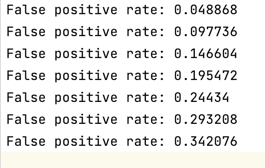
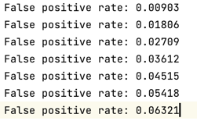
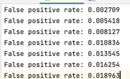
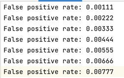
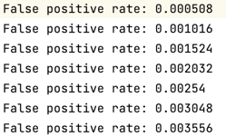

# Bloom Filter Homework
## Lab :
### 实验说明
* 本实验做了五组数据，`k : [1, 5]`
* 每组数据包含`m\n : [2, 8]`
* `m`取值恒为`1e7`
### 测试数据
#### 代码块
```cpp
while(q <= 8){//
    for (int i = 0; i < numTests / q; i++) {
        std::string add_str = std::to_string(i) + "tset";
        bloomFilter.add(add_str);
    }


    for (int i = 0; i < numTests; i++) {
        std::string ctn_str = "test" + std::to_string(i);
        if (bloomFilter.contains(ctn_str)) {
            numFalsePositives++;
        }
    }

    double falsePositiveRate = (double) numFalsePositives / numTests;
    fout << "False positive rate: " << falsePositiveRate << std::endl;
    q++;
}
```
### 实验数据

| m/n |  k   |           k=1           | k=2 | k=3 | k=4 | k=5 |
|:---:|:----:|:-----------------------:|:---:|:---:|:---:|:---:|
|  2  | 1.39 |        0.048868         |         0.00903         |        0.002709         |         0.00111         |        0.000508         |
|  3  | 2.08 |        0.097736         |         0.01806         |        0.005418         |         0.00222         |        0.001016         |
|  4  | 2.77 |        0.146604         |         0.02709         |        0.008127         |         0.00333         |        0.001524         |
|  5  | 3.46 |        0.195472         |         0.03612         |        0.010836         |         0.00444         |        0.002032         |
|  6  | 4.16 |         0.24434         |         0.04515         |        0.013545         |         0.00555         |         0.00254         |
|  7  | 4.85 |        0.293208         |         0.05418         |        0.016254         |         0.00666         |        0.003048         |
|  8  | 5.55 |        0.342076         |         0.06321         |        0.018963         |         0.00777         |        0.003556         |
| png |      |  |||||

### 数据分析
* 由于我的测试数据过于不随机，导致我误报率随着m/n增大线性增长
* 误报率大致随着k增大而减小，因为我的`bitset`数组开的比较大，而测试数据值较小，导致大部分空间被浪费，从而误报率并不够准确
* 但是可取之处在于实现保真（误报率接近理论值），是测试数据的锅。